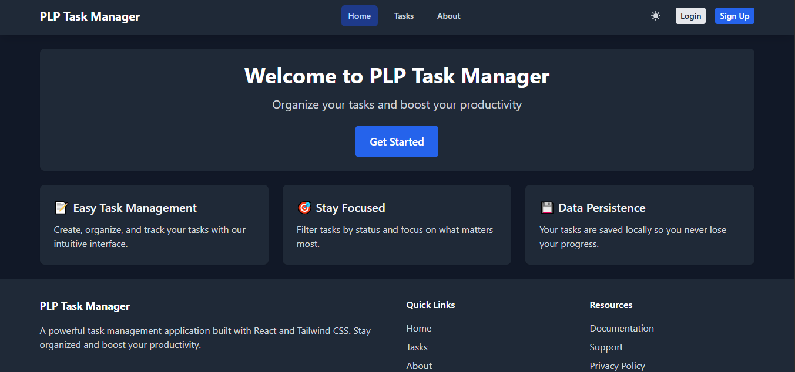
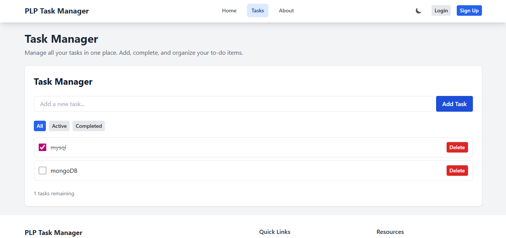
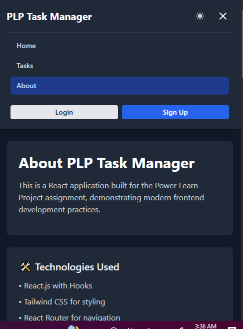

# PLP Task Manager

A responsive React application built for the Power Learn Project Week 3 assignment, demonstrating modern frontend development practices with React.js, JSX, and Tailwind CSS.

##  Features

- **Task Management**: Add, complete, delete, and filter tasks
- **Dark/Light Theme**: Toggle between themes with persistent preference
- **Responsive Design**: Works perfectly on mobile, tablet, and desktop
- **API Integration**: Fetch and display data with search and pagination
- **Routing**: Multi-page navigation with React Router
- **Local Storage**: Tasks persist between browser sessions

##  Technologies Used

- React.js 18
- Tailwind CSS
- React Router DOM
- Vite
- Context API for state management
- Custom Hooks

##  Installation & Setup

1. **Clone the repository**
   ```bash
   git clone <your-repository-url>
   cd react-js-jsx-and-css-mastering-front-end-development-Keli281
   ```
2. **Install dependencies**
   ```bash
   npm install
   ```
3. **Start development server**
   ```bash
   npm run dev
   ```
4. **Open your browser**
- Navigate to http://localhost:5173

## Project Structure
src/
├── components/          # Reusable UI components
│   ├── Button.jsx
│   ├── Card.jsx
│   ├── Navbar.jsx
│   ├── Footer.jsx
│   ├── TaskManager.jsx
│   └── ApiData.jsx
├── pages/              # Page components
│   ├── Home.jsx
│   ├── Tasks.jsx
│   └── About.jsx
├── context/            # React context
│   └── ThemeContext.jsx
├── hooks/              # Custom hooks
└── App.jsx             # Main application

## Components Overview
- **Button**: Customizable button with variants (primary, secondary, danger, success, warning)
- **Card**: Flexible container component for content
- **Navbar**: Responsive navigation with mobile menu
- **Footer**: Site footer with links and information
- **TaskManager**: Complete task management with filtering
- **ApiData**: API integration with search and pagination

## Pages
- **Home**: Welcome page with feature overview
- **Tasks**: Task management interface
- **About**: Project information and API data display

## Deployment
The application can be deployed to:
- Vercel
- Netlify
- GitHub Pages
   
## Screenshots
### Home Page (Dark Theme)


### Tasks Page (Light Theme) 


### Mobile View


## Live Demo
- [View Live Demo Here](https://react-app-eta-smoky.vercel.app/)

## Developer 
Built by Natalie Awinja, for PLP Week 3 Assignment.